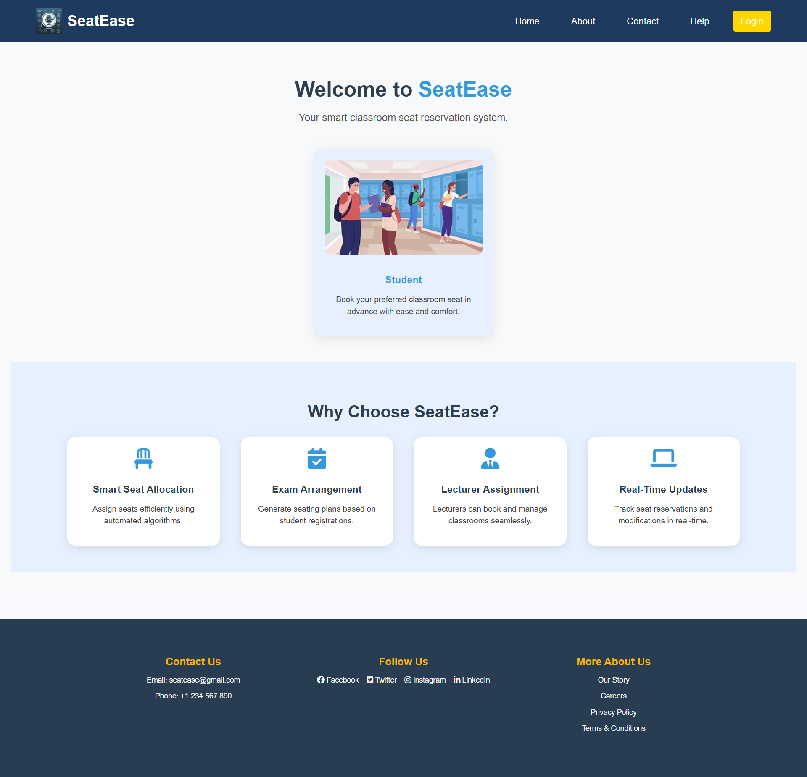

# SeatEase 🎓🪑

A **smart classroom seat reservation system** built with **HTML, CSS, and JavaScript**.
Easily manage seat allocations, exam seating plans, lecturer assignments, and real-time updates.

---

## 🚀 Features

* 🪑 **Smart Seat Allocation** – Assign seats efficiently using simple logic.
* 📝 **Exam Arrangement** – Generate exam seating plans.
* 👩‍🏫 **Lecturer Assignment** – Manage classrooms and lecturers with ease.
* 🔄 **Real-Time Updates** – Track reservations and modifications live.

---

## 📂 Tech Stack

* 🌐 **Frontend**: HTML, CSS, JavaScript
* 🎨 **Design**: Responsive & clean UI

---


## 📸 Screenshots

 


## ⚡ How to Run

1. Clone the repository:

   ```bash
   git clone https://github.com/your-username/SeatEase.git
   ```
2. Open `home.html` in your browser.

---

## 🤝 Contributing

Contributions are welcome! Feel free to fork the repo and submit pull requests.


---

Would you like me to also **add shields.io badges** (like HTML5, CSS3, JavaScript, MIT License, etc.) at the top to make it look more professional?
